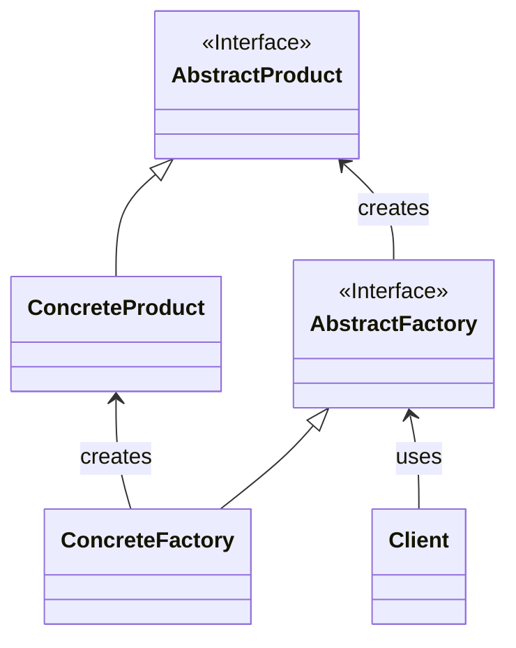

Abstract Factory（抽象ファクトリー）パターンは、ソフトウェアデザインパターンの一つで、関連する一連のオブジェクトを生成するためのインターフェースを提供します。このパターンは、一つのファクトリーが複数の関連するオブジェクトを生成し、これらのオブジェクトのインスタンスを交換可能にします。これにより、一貫性のあるオブジェクトの生成を保ちながら、具体的なオブジェクトの種類を変更できる柔軟性が得られます。

### **主な要素**

1. **AbstractFactory（抽象ファクトリー）**: 関連する一連のオブジェクトを生成するためのインターフェースを提供する抽象クラスやインターフェースです。
2. **ConcreteFactory（具体的なファクトリー）**: AbstractFactory を実装し、具体的なオブジェクトの生成を行います。
3. **AbstractProduct（抽象製品）**: 生成されるオブジェクトの共通のインターフェースや抽象クラスを定義します。
4. **ConcreteProduct（具体的な製品）**: AbstractProduct を実装し、具体的なオブジェクトの構造を提供します。
5. **Client（クライアント）**: AbstractFactory を通じて具体的なオブジェクトを生成し、これらのオブジェクトを利用します。

### クラス図

クラス図で表すと以下の様な形である。



### **Abstract Factory パターンの実装例**

以下は、Java 言語を使用した Abstract Factory パターンの実装例です。例として、GUI コンポーネントを生成する Abstract Factory パターンを考えてみます。

```java
javaCopy code
// 抽象ファクトリー
interface GUIFactory {
    Button createButton();
    CheckBox createCheckBox();
}

// 具体的なファクトリー1
class WindowsFactory implements GUIFactory {
    @Override
    public Button createButton() {
        return new WindowsButton();
    }

    @Override
    public CheckBox createCheckBox() {
        return new WindowsCheckBox();
    }
}

// 具体的なファクトリー2
class MacOSFactory implements GUIFactory {
    @Override
    public Button createButton() {
        return new MacOSButton();
    }

    @Override
    public CheckBox createCheckBox() {
        return new MacOSCheckBox();
    }
}

// 抽象製品(Button)
interface Button {
    void paint();
}

// 具体的な製品(Button)1
class WindowsButton implements Button {
    @Override
    public void paint() {
        System.out.println("Windows button");
    }
}

// 具体的な製品(Button)2
class MacOSButton implements Button {
    @Override
    public void paint() {
        System.out.println("MacOS button");
    }
}

// 抽象製品(CheckBox)
interface CheckBox {
    void paint();
}

// 具体的な製品(CheckBox)1
class WindowsCheckBox implements CheckBox {
    @Override
    public void paint() {
        System.out.println("Windows checkbox");
    }
}

// 具体的な製品(CheckBox)2
class MacOSCheckBox implements CheckBox {
    @Override
    public void paint() {
        System.out.println("MacOS checkbox");
    }
}

// クライアント
public class Client {
    public static void main(String[] args) {
        // WindowsのGUIファクトリーを使ってボタンとチェックボックスを生成
        GUIFactory windowsFactory = new WindowsFactory();
        Button windowsButton = windowsFactory.createButton();
        CheckBox windowsCheckBox = windowsFactory.createCheckBox();

        // MacOSのGUIファクトリーを使ってボタンとチェックボックスを生成
        GUIFactory macOSFactory = new MacOSFactory();
        Button macOSButton = macOSFactory.createButton();
        CheckBox macOSCheckBox = macOSFactory.createCheckBox();

        // 各オブジェクトの描画
        windowsButton.paint();
        windowsCheckBox.paint();

        macOSButton.paint();
        macOSCheckBox.paint();
    }
}

```

この例では、**`GUIFactory`** が抽象ファクトリーであり、それぞれのプラットフォーム（Windows や MacOS）ごとに **`WindowsFactory`** や **`MacOSFactory`** が具体的なファクトリーを表しています。各ファクトリーは対応するプラットフォームの GUI コンポーネントを生成します。

### **利用例**

Abstract Factory パターンは、以下のような場面で利用されます：

1. **異なる製品ファミリーをサポートする場合**: 異なるプラットフォームや製品ファミリーをサポートする際、Abstract Factory パターンはプラットフォーム依存のオブジェクトの生成を隠蔽します。
2. **オブジェクトの生成プロセスが複雑な場合**: オブジェクトの生成プロセスが複雑で、異なる部分が関連している場合、Abstract Factory パターンはこれらの関連するオブジェクトを同時に生成する手間を省略します。
3. **オブジェクトの変更が頻繁に行われる場合**: Abstract Factory パターンを使用することで、変更があった場合にも影響を最小限に抑えることができます。

Abstract Factory パターンは、システムの拡張性や保守性を高め、プラットフォーム依存性を隠蔽するのに役立ちます。
