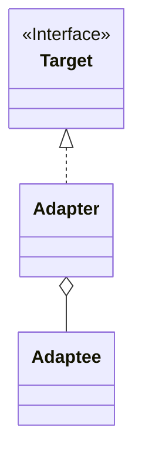

Adapter（アダプター）パターンは、既存のクラスと新しいクラスとの間でインターフェースの不一致を解消するためのデザインパターンです。このパターンを使用することで、互換性のないインターフェースを持つクラス同士が協調できるようになります。

### 主な要素

1. **Target（ターゲット）**: クライアントが利用するインターフェースを定義します。Adapter パターンでは、このインターフェースが新しいクラスのものです。
2. **Adaptee（アダプティ）**: 既存のクラスで、クライアントが直接利用できないインターフェースを持っています。このクラスを利用するために、Adapter パターンが必要です。
3. **Adapter（アダプター）**: Adaptee のインターフェースを Target のインターフェースに変換します。これにより、新しいクラスが既存のクラスを利用できるようになります。

### クラス図

上記の要素をクラス図で表すと以下の様な形である。



### 実例: 電源アダプター

具体例として、電源アダプターを考えてみましょう。ノート PC（Adaptee）は、コンセント（Target）に直接差し込むことはできません。ここで、電源アダプター（Adapter）が必要になります。

```java
// ターゲット（コンセント）
interface Outlet {
    void connect();
}

// アダプティ（ノートPC）
class Laptop{
    void plugIntoSocket() {
        System.out.println("Connected to the socket");
    }
}

// アダプター（電源アダプター）
class ChargerAdapter implements Outlet {
    private Laptop laptop;

    public ChargerAdapter(Laptop laptop) {
        this.laptop = laptop;
    }

    @Override
    public void connect() {
        laptop.plugIntoSocket();
    }
}

// 利用例
public class Main {
    public static void main(String[] args) {
        Laptop laptop = new Laptop();
        Outlet outlet = new ChargerAdapter(laptop);

        outlet.connect(); // コンセントに接続するが、内部的には既存の充電器を利用
    }
}

```

この例では、`Outlet` が新しいインターフェース（Target）を表し、`Laptop` が既存のクラス（Adaptee）を表しています。そして、`ChargerAdapter` がアダプターとなり、`Laptop` の挙動を `Outlet` のインターフェースに変換しています。

### まとめ

Adapter パターンは、既存のクラスと新しいクラスとの間で円滑な連携を実現するために使用されます。これにより、既存のコードを再利用でき、互換性のないクラス同士を統合する際に柔軟性を提供します。しばしば、外部のライブラリやコンポーネントとの連携において有用なデザインパターンとされています。
