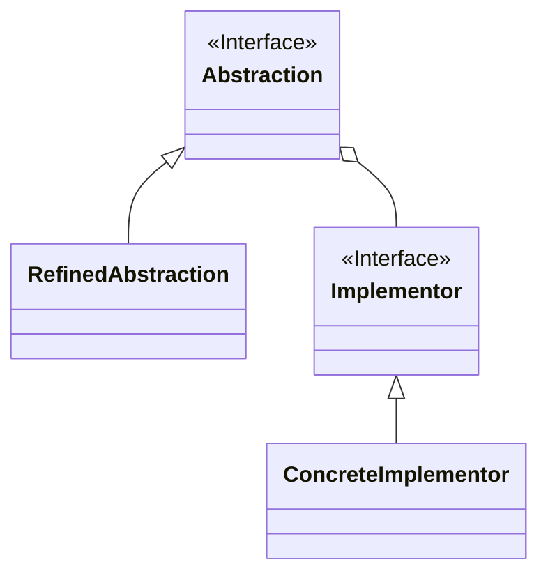

Bridge（ブリッジ）パターンは、ソフトウェアデザインパターンの一つで、クラスの抽象化と実装の両方を分離し、それらが独立して変更できるようにするためのパターンである。
これにより、クラスの拡張と実装の変更を分けて行うことができ、柔軟性と拡張性を向上させる。

# **主な要素**

1. **Abstraction（抽象化）**: 抽象化されたクラスを表すクラスやインターフェース。抽象クラスは実装クラスへの参照を保持し、実際の実装を委譲する。
2. **RefinedAbstraction（洗練された抽象化）**: Abstraction を拡張したクラス。より具体的な機能を追加できる。
3. **Implementor（実装）**: 実装クラスを表すインターフェースや抽象クラス。Implementor は Abstraction によって参照される。
4. **ConcreteImplementor（具体的な実装）**: Implementor を実装する具体的なクラス。これが実際の機能を提供する。

# クラス図

クラス図で表すと以下の様な形である。



# **Bridge パターンの実装例**

以下は、Java 言語を使用した Bridge パターンの実装例である。例として、異なる種類の橋を作成するソフトウェアを考えてみよう。

```java
javaCopy code
// 実装
interface Workshop {
    void work();
}

// 具体的な実装1
class Assemble implements Workshop {
    @Override
    public void work() {
        System.out.println("Assembling the vehicle");
    }
}

// 具体的な実装2
class Produce implements Workshop {
    @Override
    public void work() {
        System.out.println("Producing the vehicle");
    }
}

// 抽象化
abstract class Vehicle {
    protected Workshop workshop1;
    protected Workshop workshop2;

    protected Vehicle(Workshop workshop1, Workshop workshop2) {
        this.workshop1 = workshop1;
        this.workshop2 = workshop2;
    }

    abstract void manufacture();
}

// 洗練された抽象化
class Bike extends Vehicle {
    public Bike(Workshop workshop1, Workshop workshop2) {
        super(workshop1, workshop2);
    }

    @Override
    void manufacture() {
        System.out.println("Manufacturing Bike");
        workshop1.work();
        workshop2.work();
    }
}

class Car extends Vehicle {
    public Car(Workshop workshop1, Workshop workshop2) {
        super(workshop1, workshop2);
    }

    @Override
    void manufacture() {
        System.out.println("Manufacturing Car");
        workshop1.work();
        workshop2.work();
    }
}

// クライアント
public class Client {
    public static void main(String[] args) {
        Workshop assemble = new Assemble();
        Workshop produce = new Produce();

        Vehicle bike = new Bike(assemble, produce);
        Vehicle car = new Car(assemble, produce);

        bike.manufacture();
        car.manufacture();
    }
}

```

この例では、**`Workshop`** が実装を表し、**`Assemble`** と **`Produce`** がそれぞれ具体的な実装を提供している。
**`Vehicle`** が抽象化を表し、**`Bike`** と **`Car`** が洗練された抽象化を提供する。**`Vehicle`** は **`Workshop`** を使って実際の作業を行う。

# **利用例**

Bridge パターンは、以下のような場面で利用される：

1. **クラスとその実装を分離する場合**: クラスの階層構造と実装の階層構造を分離することで、それぞれを独立して変更できる。
2. **実装の変更が頻繁に発生する場合**: 実装が変更される可能性がある場合、Bridge パターンを使用することで変更が抽象クラスに影響を与えず、柔軟な設計が可能である。
3. **機能の拡張が必要な場合**: Abstraction と Implementor を別々に拡張でき、新しい機能を追加するのが容易である。

Bridge パターンは、特に大規模なシステムや複雑なクラス階層が存在する場合に有用である。それにより、クラスの拡張や実装の変更が簡単に行えるようになる。
