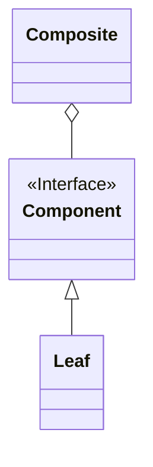

Composite（コンポジット）パターンは、ソフトウェアデザインパターンの一つで、再帰的及びツリー構造を持つオブジェクトのグルーピングを表現するためのパターンです。このパターンでは、単一のオブジェクトと複数のオブジェクトを同じように扱うことができます。これにより、クライアントが単一のオブジェクトとグループ化された複数のオブジェクトを区別せずに操作できます。

### **主な要素**

1. **Component（コンポーネント）**: すべての要素が共通のインターフェースを持つ抽象クラスやインターフェースです。すべての要素に共通する振る舞いを定義します。
2. **Leaf（葉）**: コンポーネントの葉の部分を表すクラスです。これは子要素を持たず、単一のオブジェクトを表します。
3. **Composite（複合体）**: コンポーネントの複合体を表すクラスです。これは子要素を持ち、これらの子要素を操作するためのメソッドを提供します。

### クラス図

クラス図で表すと以下の様な形である。



### **Composite パターンの実装例**

以下は、Java 言語を使用した Composite パターンの実装例です。例として、ファイルシステムの階層構造を考えてみましょう。

```java
javaCopy code
// Component インターフェース
interface FileSystemComponent {
    void showInfo();
}

// Leaf クラス
class File implements FileSystemComponent {
    private String name;

    public File(String name) {
        this.name = name;
    }

    @Override
    public void showInfo() {
        System.out.println("File: " + name);
    }
}

// Composite クラス
class Directory implements FileSystemComponent {
    private String name;
    private List<FileSystemComponent> components = new ArrayList<>();

    public Directory(String name) {
        this.name = name;
    }

    public void addComponent(FileSystemComponent component) {
        components.add(component);
    }

    @Override
    public void showInfo() {
        System.out.println("Directory: " + name);
        for (FileSystemComponent component : components) {
            component.showInfo();
        }
    }
}

// クライアント
public class Client {
    public static void main(String[] args) {
        // ファイルシステムの階層構造を作成
        Directory root = new Directory("Root");
        Directory documents = new Directory("Documents");
        Directory music = new Directory("Music");
        File file1 = new File("file1.txt");
        File file2 = new File("file2.txt");

        root.addComponent(documents);
        root.addComponent(music);
        documents.addComponent(file1);
        music.addComponent(file2);

        // ファイルシステムの情報を表示
        root.showInfo();
    }
}

```

この例では、**`FileSystemComponent`** インターフェースがコンポーネントを表し、**`File`** クラスが葉を、**`Directory`** クラスが複合体を表します。**`Directory`** クラスは子要素を持ち、これらの子要素を操作して自身の情報を表示します。

### **利用例**

Composite パターンは、以下のような場面で利用されます：

1. **ツリー構造を持つオブジェクトを扱う場合**: ツリー構造を持つオブジェクトのグルーピングや操作を効率的に行いたい場合、Composite パターンは有用です。
2. **同じような操作を複数のオブジェクトに対して適用したい場合**: 同じような操作を葉と複合体の両方に適用したい場合、Composite パターンを使用してこれらのオブジェクトを同じように扱うことができます。
3. **オブジェクトのネストや階層構造を表現する場合**: オブジェクトのネストや階層構造を表現する際、Composite パターンは階層的な関係を簡潔に表現できます。

Composite パターンは、特に階層的な構造を持つオブジェクトを効果的に表現する場合に役立ちます。それにより、再帰的な操作や複数のオブジェクトをまとめて扱うことができます。
