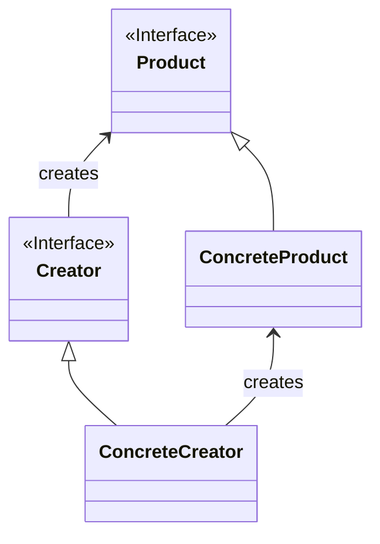

Factory Method（ファクトリメソッド）パターンは、ソフトウェアデザインパターンの一つで、オブジェクトの生成処理をサブクラスに委譲する方法を提供します。これにより、生成される具体的なオブジェクトの型をサブクラスが決定でき、クライアントコードは生成されるオブジェクトの具体的なクラスを意識せずに利用できます。

### **主な要素**

1. **Product（製品）**: 生成されるオブジェクトのインターフェースまたは抽象クラスを定義します。
2. **ConcreteProduct（具体的な製品）**: Product インターフェースを実装する具体的なクラスです。Factory Method パターンでは、これを生成するのが目的です。
3. **Creator（生成者）**: Product インターフェースを持ち、ConcreteProduct の生成メソッドを宣言した抽象クラスまたはインターフェースです。
4. **ConcreteCreator（具体的な生成者）**: Creator インターフェースを実装し、具体的な ConcreteProduct の生成処理を行うクラスです。

### クラス図

クラス図で表すと以下の様な形である。



### **実例: ページの生成**

例として、ウェブページの生成を考えてみましょう。ここでは、ページ内にテキストや画像などの要素が配置されるとします。

```java
javaCopy code
// 製品（Product）：ページの要素を表す抽象クラス
interface Page {
    void addContent(String content);
    void render();
}

// 具体的な製品（ConcreteProduct）：HTMLページ
class HtmlPage implements Page {
    private String content;

    @Override
    public void addContent(String content) {
        this.content = content;
    }

    @Override
    public void render() {
        System.out.println("<html><body>" + content + "</body></html>");
    }
}

// 生成者（Creator）：ページを生成する抽象クラス
abstract class PageCreator {
    // ファクトリメソッド
    abstract Page createPage();

    // ページ生成のテンプレートメソッド
    public Page generatePage(String content) {
        Page page = createPage();
        page.addContent(content);
        return page;
    }
}

// 具体的な生成者（ConcreteCreator）：HTMLページ生成者
class HtmlPageCreator extends PageCreator {
    @Override
    Page createPage() {
        return new HtmlPage();
    }
}

// 利用例
public class Main {
    public static void main(String[] args) {
        PageCreator htmlPageCreator = new HtmlPageCreator();
        Page htmlPage = htmlPageCreator.generatePage("This is an HTML page.");
        htmlPage.render();
    }
}

```

この例では、**`Page`** インターフェースが製品を定義し、**`HtmlPage`** がその具体的な実装です。**`PageCreator`** が生成者として、**`HtmlPageCreator`** が具体的な生成者です。クライアントコードは **`PageCreator`** に対して生成を依頼し、具体的な生成者によって生成された製品を利用します。

### **まとめ**

Factory Method パターンは、オブジェクトの生成処理をサブクラスに委譲し、生成される具体的なオブジェクトの型をサブクラスが決定できる柔軟なデザインを提供します。これにより、クライアントコードは具体的な製品のクラスを意識せずに利用できます。このパターンは、新しい製品が追加される可能性がある場合や、生成処理がサブクラスで変更される可能性がある場合に特に有用です。
