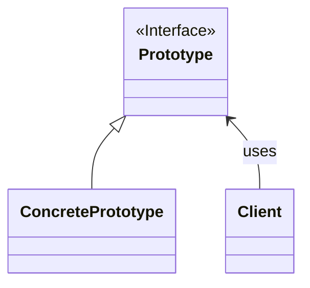

Prototype（プロトタイプ）パターンは、ソフトウェアデザインパターンの一つで、新しいオブジェクトのインスタンスを複製するための方法を提供します。このパターンは、クラスのインスタンスを生成するための手続きを定義し、その手続きを用いて新しいオブジェクトを生成します。

### **主な要素**

1. **Prototype（プロトタイプ）**: 複製をサポートするために、**`clone`** メソッドなどを提供するインターフェースや抽象クラスです。
2. **ConcretePrototype（具体的なプロトタイプ）**: Prototype インターフェースを実装し、**`clone`** メソッドによって自分自身の複製を生成します。
3. **Client（クライアント）**: 新しいオブジェクトの複製を要求し、Prototype を使用して複製を行います。

### クラス図

クラス図で表すと以下の様な形である。



### **Prototype パターンの実装例**

以下は、Java 言語を使用した Prototype パターンの単純な実装例です。

```java
javaCopy code
// Prototype インターフェース
interface Prototype {
    Prototype clone();
}

// ConcretePrototype クラス
class ConcretePrototype implements Prototype {
    private String data;

    public ConcretePrototype(String data) {
        this.data = data;
    }

    @Override
    public Prototype clone() {
        return new ConcretePrototype(this.data);
    }

    public String getData() {
        return data;
    }
}

// Client クラス
public class Client {
    public static void main(String[] args) {
        ConcretePrototype prototype = new ConcretePrototype("Original Data");

        // オリジナルオブジェクトから複製を生成
        ConcretePrototype clone = (ConcretePrototype) prototype.clone();

        System.out.println("Original Data: " + prototype.getData());
        System.out.println("Cloned Data: " + clone.getData());
    }
}

```

この例では、**`Prototype`** インターフェースが **`clone`** メソッドを定義し、**`ConcretePrototype`** クラスがこれを実装しています。クライアントはオリジナルオブジェクトを作成し、その **`clone`** メソッドを使用して新しいオブジェクトを生成します。

### **利用例**

Prototype パターンは、以下のようなケースで有用です。

1. **大量のオブジェクトを生成する際**: オブジェクトの生成に時間やリソースがかかる場合、同じオブジェクトの複製を使って新しいオブジェクトを生成することで、効率を向上させることができます。
2. **クラスのインスタンスの初期化が複雑な場合**: クラスのコンストラクタが複雑で、同じようなオブジェクトを複数生成する場合、既存のオブジェクトを複製することで初期化の手間を省略できます。
3. **プロトタイプの動的な切り替えが必要な場合**: インスタンスの具体的なクラスが実行時に切り替わる必要がある場合、Prototype パターンは柔軟性を提供します。

注意点として、**`clone`** メソッドの使用には注意が必要で、深いコピー（deep copy）や浅いコピー（shallow copy）など、オブジェクトの構造によって適切な実装を選ぶ必要があります。
