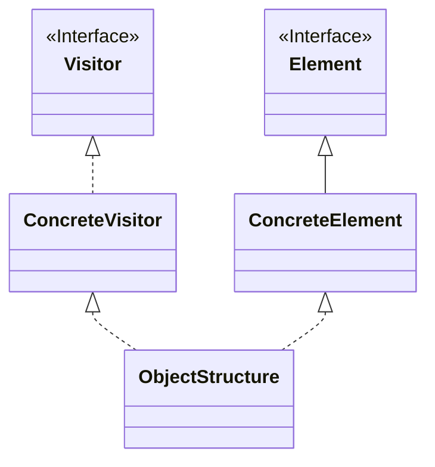

Visitor（ビジター）パターンは、ソフトウェアデザインパターンの一つで、オブジェクト構造内の各要素に対して、新しい操作を追加するためのパターンです。このパターンでは、操作を実装する新しいクラス（Visitor）を作成し、それをオブジェクト構造内の各要素に適用します。これにより、オブジェクトのクラス階層を変更せずに、新しい操作を追加できます。

### **主な要素**

1. **Visitor（ビジター）**: 新しい操作を表すインターフェースや抽象クラスです。Visitor インターフェースには、オブジェクト構造内の各要素を訪問するためのメソッドが含まれます。
2. **ConcreteVisitor（具体的なビジター）**: Visitor を実装した具体的なクラスで、新しい操作の具体的な実装を提供します。
3. **Element（要素）**: Visitor によって訪問されるオブジェクトのインターフェースや抽象クラスです。Element インターフェースには、Visitor を受け入れるためのメソッドが含まれます。
4. **ConcreteElement（具体的な要素）**: Element を実装した具体的なクラスで、Visitor を受け入れるメソッドの具体的な実装を提供します。
5. **ObjectStructure（オブジェクト構造）**: Element オブジェクトを保持し、Visitor を受け入れるメソッドを提供します。

### クラス図

クラス図で表すと以下の様な形である。



### **Visitor パターンの実装例**

以下は、Java 言語を使用した Visitor パターンの実装例です。例として、異なる種類の動物に対してサウンドを発する操作を追加することを考えてみましょう。

```java
javaCopy code
// Visitor インターフェース
interface AnimalVisitor {
    void visit(Dog dog);
    void visit(Cat cat);
}

// ConcreteVisitor クラス
class SoundVisitor implements AnimalVisitor {
    @Override
    public void visit(Dog dog) {
        System.out.println("Dog barks");
    }

    @Override
    public void visit(Cat cat) {
        System.out.println("Cat meows");
    }
}

// Element インターフェース
interface Animal {
    void accept(AnimalVisitor visitor);
}

// ConcreteElement クラス
class Dog implements Animal {
    @Override
    public void accept(AnimalVisitor visitor) {
        visitor.visit(this);
    }
}

class Cat implements Animal {
    @Override
    public void accept(AnimalVisitor visitor) {
        visitor.visit(this);
    }
}

// ObjectStructure クラス
class AnimalStructure {
    private List<Animal> animals = new ArrayList<>();

    public void addAnimal(Animal animal) {
        animals.add(animal);
    }

    public void performOperation(AnimalVisitor visitor) {
        for (Animal animal : animals) {
            animal.accept(visitor);
        }
    }
}

// クライアント
public class Client {
    public static void main(String[] args) {
        Animal dog = new Dog();
        Animal cat = new Cat();

        AnimalStructure animalStructure = new AnimalStructure();
        animalStructure.addAnimal(dog);
        animalStructure.addAnimal(cat);

        AnimalVisitor soundVisitor = new SoundVisitor();
        animalStructure.performOperation(soundVisitor);
    }
}

```

この例では、**`AnimalVisitor`** インターフェースが Visitor を表し、**`SoundVisitor`** クラスが具体的な Visitor を提供します。**`Animal`** インターフェースが Element を表し、**`Dog`** クラスと **`Cat`** クラスが具体的な Element を提供します。**`AnimalStructure`** クラスがオブジェクト構造を表し、**`performOperation`** メソッドを使用して Visitor を受け入れます。

### **利用例**

Visitor パターンは、以下のような場面で利用されます：

1. **オブジェクトの構造と操作が分離されている場合**: オブジェクトの構造と操作が分離されている場合、Visitor パターンはオブジェクト構造に新しい操作を追加するための効果的な手段となります。
2. **複数のオブジェクトで同じ操作を実行したい場合**: 複数のオブジェクトで同じ操作を実行したい場合、Visitor パターンは各オブジェクトのクラス階層を変更することなく、新しい操作を追加できます。
3. **オブジェクトのクラス階層を変更したくない場合**: オブジェクトのクラス階層を変更せずに、新しい操作を追加したい場合、Visitor パターンは適しています。

Visitor パターンは、特にオブジェクトの構造と操作が分離されている場合や、新しい操作の追加が頻繁に発生する場合に有用です。それにより、柔軟性と拡張性を向上させることができます。
