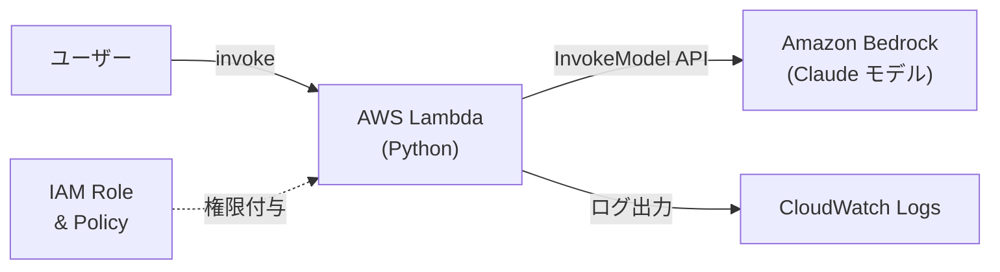

## はじめに

生成 AI をプロダクトに組み込みたいけれど、モデルのホスティングやインフラ管理が大変そう…。そんな悩みを解決してくれるのが **Amazon Bedrock** です。

本記事では、Bedrock を触ったことがないエンジニア向けに **概要の紹介** と **Terraform を使った実践ハンズオン** をお届けします。

---

## 1. Amazon Bedrock とは？

Amazon Bedrock は、AWS が提供するフルマネージドサービスで、主要な AI 企業が開発した高性能な基盤モデル（Foundation Model）に対して、安全かつエンタープライズグレードのアクセスを提供し、生成 AI アプリケーションの構築・スケールを可能にします。

### 1.1 主な特徴

| 特徴                             | 説明                                                                                                                                           |
| -------------------------------- | ---------------------------------------------------------------------------------------------------------------------------------------------- |
| **フルマネージド**               | サーバーのデプロイもモデルランタイムの管理もスケーリングも不要。モデルを選び、ペイロードを整形して、リクエストを送るだけです。                 |
| **複数モデルを単一 API で利用**  | Anthropic、Meta、Stability AI、Amazon など大手 AI 企業のモデルに簡単にアクセスでき、単一の API で選択可能です。                                |
| **カスタマイズ**                 | ファインチューニング、Knowledge Bases、RAG、プロンプトエンジニアリングなど複数のカスタマイズ手法を組み合わせて、自社ビジネスに最適化できます。 |
| **エンタープライズセキュリティ** | 業界最高水準のセキュリティ・プライバシー・コンプライアンスを提供。データがモデルの学習に使われることはありません。                             |
| **コンプライアンス**             | ISO、SOC、CSA STAR Level 2、GDPR、FedRAMP High に対応し、HIPAA 対象です。                                                                      |
| **コスト最適化**                 | Prompt Caching や Intelligent Prompt Routing により、コストを削減しつつパフォーマンスを維持できます。                                          |

### 1.2 料金体系

料金プランは大きく **オンデマンド** と **バッチ** の従量課金制があります。オンデマンドはトークン単位で課金され、バッチでは一連のプロンプトをまとめて処理できます。そのほかに、一定スループットを確保する **プロビジョンドスループット** があります。料金はモデルやリージョンによって異なるため、[公式料金ページ](https://aws.amazon.com/bedrock/pricing/)をご確認ください。

---

## 2. 前提条件

ハンズオンを始める前に以下を準備してください。

- **AWS アカウント**（Bedrock が利用可能なリージョン：`us-east-1` 推奨）
- **AWS CLI** がインストール・設定済み
- **Terraform** がインストール済み（v1.14 以降を推奨）
- **Bedrock のモデルアクセス有効化** — AWS コンソール → Amazon Bedrock → 「Model access」から利用したいモデルのアクセスをリクエストしてください。

> **注意：** 一部のモデルは EULA への同意が必要なため、初回のアクセスリクエストはコンソールから行う必要があります。

---

## 3. ハンズオン構成

本ハンズオンでは以下の構成を Terraform でデプロイします。



**ゴール：** Lambda 関数から Bedrock の基盤モデル（Claude）を呼び出して、テキスト生成を行うシンプルなパイプラインを構築します。

---

## 4. ディレクトリ構成

```
bedrock-handson/
├── main.tf           # メインリソース定義
├── variables.tf      # 変数定義
├── outputs.tf        # 出力定義
├── provider.tf       # プロバイダー設定
├── iam.tf            # IAM ロール・ポリシー
├── lambda_src/
│   └── index.py      # Lambda ハンドラー（Python）
└── terraform.tfvars  # 変数値（任意）
```

---

## 5. Terraform コード

### 5.1 `provider.tf`

```hcl
terraform {
  required_version = ">= 1.14.0"

  required_providers {
    aws = {
      source  = "hashicorp/aws"
      version = "~> 5.49"
    }
    archive = {
      source  = "hashicorp/archive"
      version = "~> 2.4"
    }
    null = {
      source  = "hashicorp/null"
      version = "~> 3.2"
    }
  }
}

provider "aws" {
  region = var.aws_region

  default_tags {
    tags = {
      Project   = "bedrock-handson"
      ManagedBy = "terraform"
    }
  }
}
```

### 5.2 `variables.tf`

```hcl
variable "aws_region" {
  description = "AWS リージョン"
  type        = string
  default     = "us-east-1"
}

variable "bedrock_model_id" {
  description = "Bedrock で使用する基盤モデルの ID"
  type        = string
  default     = "amazon.nova-lite-v1:0"
}

variable "lambda_function_name" {
  description = "Lambda 関数名"
  type        = string
  default     = "bedrock-invoke-demo"
}
```

### 5.3 `iam.tf`

```hcl
# -----------------------------------------------
# Lambda 実行用 IAM ロール
# -----------------------------------------------
resource "aws_iam_role" "lambda_bedrock_role" {
  name = "lambda-bedrock-execution-role"

  assume_role_policy = jsonencode({
    Version = "2012-10-17"
    Statement = [
      {
        Action = "sts:AssumeRole"
        Effect = "Allow"
        Principal = {
          Service = "lambda.amazonaws.com"
        }
      }
    ]
  })
}

# CloudWatch Logs への書き込み権限
resource "aws_iam_role_policy_attachment" "lambda_basic_execution" {
  role       = aws_iam_role.lambda_bedrock_role.name
  policy_arn = "arn:aws:iam::aws:policy/service-role/AWSLambdaBasicExecutionRole"
}

# Bedrock InvokeModel 権限
resource "aws_iam_role_policy" "bedrock_invoke_policy" {
  name = "bedrock-invoke-policy"
  role = aws_iam_role.lambda_bedrock_role.id

  policy = jsonencode({
    Version = "2012-10-17"
    Statement = [
      # Bedrock モデル呼び出し権限（既存）
      {
        Effect = "Allow"
        Action = [
          "bedrock:InvokeModel",
          "bedrock:InvokeModelWithResponseStream"
        ]
        Resource = "arn:aws:bedrock:${var.aws_region}::foundation-model/*"
      },
      # AWS Marketplace 権限（追加）
      {
        Effect = "Allow"
        Action = [
          "aws-marketplace:ViewSubscriptions",
          "aws-marketplace:Subscribe",
          "aws-marketplace:Unsubscribe"
        ]
        Resource = "*"
      }
    ]
  })
}
```

### 5.4 `main.tf`

```hcl
# -----------------------------------------------
# Lambda 関数用ビルドディレクトリの作成
# -----------------------------------------------
resource "null_resource" "create_build_dir" {
  provisioner "local-exec" {
    command = "mkdir -p ${path.module}/.build"
  }
}

# -----------------------------------------------
# Lambda 関数用 ZIP パッケージ
# -----------------------------------------------
data "archive_file" "lambda_zip" {
  type        = "zip"
  source_dir  = "${path.module}/lambda_src"
  output_path = "${path.module}/.build/lambda.zip"

  depends_on = [null_resource.create_build_dir]
}

# -----------------------------------------------
# CloudWatch Logs ロググループ
# -----------------------------------------------
resource "aws_cloudwatch_log_group" "lambda_log" {
  name              = "/aws/lambda/${var.lambda_function_name}"
  retention_in_days = 14
}

# -----------------------------------------------
# Lambda 関数
# -----------------------------------------------
resource "aws_lambda_function" "bedrock_demo" {
  function_name    = var.lambda_function_name
  role             = aws_iam_role.lambda_bedrock_role.arn
  handler          = "index.handler"
  runtime          = "python3.12"
  timeout          = 60
  memory_size      = 256
  filename         = data.archive_file.lambda_zip.output_path
  source_code_hash = data.archive_file.lambda_zip.output_base64sha256

  environment {
    variables = {
      BEDROCK_MODEL_ID = var.bedrock_model_id
    }
  }

  depends_on = [
    aws_iam_role_policy_attachment.lambda_basic_execution,
    aws_cloudwatch_log_group.lambda_log,
  ]
}
```

### 5.5 `outputs.tf`

```hcl
output "lambda_function_name" {
  description = "デプロイされた Lambda 関数名"
  value       = aws_lambda_function.bedrock_demo.function_name
}

output "lambda_function_arn" {
  description = "Lambda 関数の ARN"
  value       = aws_lambda_function.bedrock_demo.arn
}

output "bedrock_model_id" {
  description = "使用している Bedrock モデル ID"
  value       = var.bedrock_model_id
}
```

### 5.6 `lambda_src/index.py`

```python
import json
import boto3
import os

bedrock = boto3.client("bedrock-runtime", region_name=os.environ["AWS_REGION"])

def handler(event, context):
    user_message = event.get("message", "こんにちは。AWS Lambda から Bedrock を呼んでいます。")

    response = bedrock.converse(
        modelId="amazon.nova-lite-v1:0",
        messages=[
            {
                "role": "user",
                "content": [
                    {"text": user_message}
                ]
            }
        ],
        inferenceConfig={
            "maxTokens": 300,
            "temperature": 0.7
        }
    )

    output_text = ""
    for item in response["output"]["message"]["content"]:
        if "text" in item:
            output_text += item["text"]

    return {
        "statusCode": 200,
        "body": json.dumps({
            "reply": output_text
        }, ensure_ascii=False)
    }
```

---

## 6. デプロイ手順

### 6.1 初期化 & プラン

```bash
cd bedrock-handson

# Terraform 初期化
terraform init

# 実行計画の確認
terraform plan
```

### 6.2 デプロイ

```bash
terraform apply
```

`yes` を入力して適用します。

### 6.3 動作確認

AWS CLI で Lambda 関数を呼び出します。

```bash
# デフォルトプロンプトで実行
aws lambda invoke
  --function-name bedrock-invoke-demo
  --cli-binary-format raw-in-base64-out
  --payload '{}'
  response.json

cat response.json | jq .
```

カスタムプロンプトを送る場合：

```bash
aws lambda invoke
  --function-name bedrock-invoke-demo
  --cli-binary-format raw-in-base64-out
  --payload '{"prompt": "Pythonでクイックソートを実装してください"}'
  response.json

cat response.json | jq .body -r | jq .
```

**期待される出力例：**

```json
{
  "model": "anthropic.claude-3-haiku-20240307-v1:0",
  "prompt": "AWSのサービスを3つ挙げてください。",
  "response": "AWSの代表的なサービスを3つ挙げます：

1. **Amazon EC2** ...
2. **Amazon S3** ...
3. **AWS Lambda** ..."
}
```

### 6.4 クリーンアップ

```bash
terraform destroy
```

---

## 7. 【応用】Bedrock Guardrails を Terraform で管理する

Bedrock にはモデルの出力を制御する **Guardrails** という機能があります。Terraform でコード管理しておくと、環境間の一貫性を保てます。

```hcl
resource "aws_bedrock_guardrail" "demo_guardrail" {
  name                      = "demo-content-filter"
  description               = "ハンズオン用のコンテンツフィルター"
  blocked_input_messaging   = "この入力は許可されていません。"
  blocked_outputs_messaging = "この出力は許可されていません。"

  content_policy_config {
    filters_config {
      type             = "SEXUAL"
      input_strength   = "HIGH"
      output_strength  = "HIGH"
    }
    filters_config {
      type             = "VIOLENCE"
      input_strength   = "HIGH"
      output_strength  = "HIGH"
    }
    filters_config {
      type             = "HATE"
      input_strength   = "HIGH"
      output_strength  = "HIGH"
    }
    filters_config {
      type             = "MISCONDUCT"
      input_strength   = "HIGH"
      output_strength  = "HIGH"
    }
  }
}
```

---

## 8. Terraform で Bedrock を管理するメリット

Terraform では Bedrock リソース（エージェント、Knowledge Base、プロビジョンドスループット、カスタムモデル）をコードで定義できます。これにより以下のメリットがあります：

- **監査可能性** — 変更が PR でレビュー可能
- **再現性** — dev / staging / prod で同一構成を保証
- **GitOps ワークフロー** との統合が容易

---

## 9. 次のステップ

| ステップ             | 内容                                                                   |
| -------------------- | ---------------------------------------------------------------------- |
| **RAG 構築**         | Bedrock Knowledge Bases + OpenSearch Serverless で社内ドキュメント検索 |
| **エージェント構築** | Bedrock Agents で外部 API を呼び出すマルチステップエージェント         |
| **ストリーミング**   | `InvokeModelWithResponseStream` でリアルタイム応答を実装               |
| **コスト管理**       | Provisioned Throughput / Intelligent Prompt Routing の活用             |
| **CI/CD 統合**       | GitHub Actions + Terraform Cloud で自動デプロイパイプライン構築        |

---

## 参考リンク

- [Amazon Bedrock 公式ドキュメント](https://docs.aws.amazon.com/bedrock/latest/userguide/what-is-bedrock.html)
- [Terraform AWS Provider - Bedrock リソース](https://registry.terraform.io/providers/hashicorp/aws/latest/docs)
- [Amazon Bedrock 料金](https://aws.amazon.com/bedrock/pricing/)
