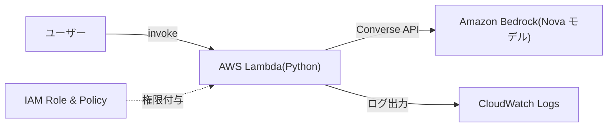

生成 AI をプロダクトに組み込みたいけれど、モデルのホスティングやインフラ管理が大変そう…。そんな悩みを解決してくれるのが **Amazon Bedrock** です。

本記事では、Bedrock を触ったことがないエンジニア向けに **概要の紹介** と **Terraform を使った実践ハンズオン** をお届けします。

# Amazon Bedrock とは？

Amazon Bedrock[^1] は、AWS が提供するフルマネージドサービスで、AWS や各種モデルプロバイダーが提供する基盤モデルに、安全かつエンタープライズグレードでアクセスできるサービスです。

## 主な特徴

| 特徴                               | 説明                                                                                                                                                                                       |
| ---------------------------------- | ------------------------------------------------------------------------------------------------------------------------------------------------------------------------------------------ |
| **フルマネージド**                 | サーバーのデプロイもモデルランタイムの管理もスケーリングも不要。モデルを選び、ペイロードを整形して、リクエストを送るだけです。                                                             |
| **複数モデルを統一的に呼び出せる** | Anthropic、Meta、Amazon などの複数のモデルを、Converse API などの共通インターフェース経由で扱える。                                                                                        |
| **カスタマイズ**                   | プロンプト設計、Knowledge Bases、モデルカスタマイズなどを組み合わせて、自社ビジネスに最適化できます。                                                                                      |
| **エンタープライズセキュリティ**   | 業界最高水準のセキュリティ・プライバシー・コンプライアンスを提供。データがモデルの学習に使われることはありません。                                                                         |
| **コスト最適化**                   | Prompt Caching や Intelligent Prompt Routing により、コストを削減しつつパフォーマンスを維持できます。（料金はモデルやリージョンによって異なるため、公式料金ページ[^2] をご確認ください。） |

# ハンズオン構成

本ハンズオンでは以下の構成を Terraform でデプロイします。

（今回は Bedrock の全機能を網羅するのではなく、Lambda から基盤モデルを呼び出す最小構成に絞って試します。）



**ゴール：** Lambda 関数から Bedrock の基盤モデル（Nova）を呼び出して、テキスト生成を行うシンプルなパイプラインを構築します。

## 前提条件

ハンズオンを始める前に以下を準備してください。

- **AWS アカウント**（Bedrock が利用可能なリージョン：`us-east-1` 推奨）
- **AWS CLI** がインストール・設定済み
- **Terraform** がインストール済み（v1.14 以降を推奨）

> **注意：** 一部のモデルは EULA への同意が必要なため、初回のアクセスリクエストはコンソールから行う必要があります。

## ディレクトリ構成

今回のハンズオンでは以下のような構成を作ります。

```
bedrock-handson/
├── main.tf           # メインリソース定義
├── variables.tf      # 変数定義
├── outputs.tf        # 出力定義
├── provider.tf       # プロバイダー設定
├── iam.tf            # IAM ロール・ポリシー
├── lambda_src/
│   └── index.py      # Lambda ハンドラー（Python）
└── terraform.tfvars  # 変数値（任意）
```

---

# Terraform コード

- provider.tf

```hcl
terraform {
  required_version = ">= 1.14.0"

  required_providers {
    aws = {
      source  = "hashicorp/aws"
      version = "~> 5.49"
    }
    archive = {
      source  = "hashicorp/archive"
      version = "~> 2.4"
    }
    null = {
      source  = "hashicorp/null"
      version = "~> 3.2"
    }
  }
}

provider "aws" {
  region = var.aws_region

  default_tags {
    tags = {
      Project   = "bedrock-handson"
      ManagedBy = "terraform"
    }
  }
}
```

- variables.tf

```hcl
variable "aws_region" {
  description = "AWS リージョン"
  type        = string
  default     = "us-east-1"
}

variable "bedrock_model_id" {
  description = "Bedrock で使用する基盤モデルの ID"
  type        = string
  default     = "amazon.nova-lite-v1:0"
}

variable "lambda_function_name" {
  description = "Lambda 関数名"
  type        = string
  default     = "bedrock-invoke-demo"
}
```

- iam.tf

```hcl
# -----------------------------------------------
# Lambda 実行用 IAM ロール
# -----------------------------------------------
resource "aws_iam_role" "lambda_bedrock_role" {
  name = "lambda-bedrock-execution-role"

  assume_role_policy = jsonencode({
    Version = "2012-10-17"
    Statement = [
      {
        Action = "sts:AssumeRole"
        Effect = "Allow"
        Principal = {
          Service = "lambda.amazonaws.com"
        }
      }
    ]
  })
}

# CloudWatch Logs への書き込み権限
resource "aws_iam_role_policy_attachment" "lambda_basic_execution" {
  role       = aws_iam_role.lambda_bedrock_role.name
  policy_arn = "arn:aws:iam::aws:policy/service-role/AWSLambdaBasicExecutionRole"
}

# Bedrock 推論 API 呼び出し権限
resource "aws_iam_role_policy" "bedrock_invoke_policy" {
  name = "bedrock-invoke-policy"
  role = aws_iam_role.lambda_bedrock_role.id

  policy = jsonencode({
    Version = "2012-10-17"
    Statement = [
      # Bedrock モデル呼び出し権限（既存）
      {
        Effect = "Allow"
        Action = [
          "bedrock:InvokeModel",
          "bedrock:InvokeModelWithResponseStream"
        ]
        Resource = "arn:aws:bedrock:${var.aws_region}::foundation-model/*"
      },
      # AWS Marketplace 権限（追加）
      {
        Effect = "Allow"
        Action = [
          "aws-marketplace:ViewSubscriptions",
          "aws-marketplace:Subscribe",
          "aws-marketplace:Unsubscribe"
        ]
        Resource = "*"
      }
    ]
  })
}
```

- main.tf

```hcl
# -----------------------------------------------
# Lambda 関数用ビルドディレクトリの作成
# -----------------------------------------------
resource "null_resource" "create_build_dir" {
  provisioner "local-exec" {
    command = "mkdir -p ${path.module}/.build"
  }
}

# -----------------------------------------------
# Lambda 関数用 ZIP パッケージ
# -----------------------------------------------
data "archive_file" "lambda_zip" {
  type        = "zip"
  source_dir  = "${path.module}/lambda_src"
  output_path = "${path.module}/.build/lambda.zip"

  depends_on = [null_resource.create_build_dir]
}

# -----------------------------------------------
# CloudWatch Logs ロググループ
# -----------------------------------------------
resource "aws_cloudwatch_log_group" "lambda_log" {
  name              = "/aws/lambda/${var.lambda_function_name}"
  retention_in_days = 14
}

# -----------------------------------------------
# Lambda 関数
# -----------------------------------------------
resource "aws_lambda_function" "bedrock_demo" {
  function_name    = var.lambda_function_name
  role             = aws_iam_role.lambda_bedrock_role.arn
  handler          = "index.handler"
  runtime          = "python3.12"
  timeout          = 60
  memory_size      = 256
  filename         = data.archive_file.lambda_zip.output_path
  source_code_hash = data.archive_file.lambda_zip.output_base64sha256

  environment {
    variables = {
      BEDROCK_MODEL_ID = var.bedrock_model_id
    }
  }

  depends_on = [
    aws_iam_role_policy_attachment.lambda_basic_execution,
    aws_cloudwatch_log_group.lambda_log,
  ]
}
```

- outputs.tf

```hcl
output "lambda_function_name" {
  description = "デプロイされた Lambda 関数名"
  value       = aws_lambda_function.bedrock_demo.function_name
}

output "lambda_function_arn" {
  description = "Lambda 関数の ARN"
  value       = aws_lambda_function.bedrock_demo.arn
}

output "bedrock_model_id" {
  description = "使用している Bedrock モデル ID"
  value       = var.bedrock_model_id
}
```

- lambda_src/index.py

```python
import json
import boto3
import os

bedrock = boto3.client("bedrock-runtime", region_name=os.environ["AWS_REGION"])

def handler(event, context):
    user_message = event.get("message", "こんにちは。AWS Lambda から Bedrock を呼んでいます。")

    model_id = os.environ["BEDROCK_MODEL_ID"]

    response = bedrock.converse(
        modelId=model_id,
        messages=[
            {
                "role": "user",
                "content": [{"text": user_message}]
            }
        ],
        inferenceConfig={
            "maxTokens": 300,
            "temperature": 0.7
        }
    )

    output_text = ""
    for item in response["output"]["message"]["content"]:
        if "text" in item:
            output_text += item["text"]

    return {
        "statusCode": 200,
        "body": json.dumps({
            "reply": output_text
        }, ensure_ascii=False)
    }
```

---

# デプロイ手順

- 初期化 & プラン

```bash
cd bedrock-handson

# Terraform 初期化
terraform init

# 実行計画の確認
terraform plan
```

- デプロイ

```bash
terraform apply
```

`yes` を入力して適用します。

- 動作確認

AWS CLI で Lambda 関数を呼び出します。

```bash
# デフォルトプロンプトで実行
aws lambda invoke \
  --function-name bedrock-invoke-demo \
  --cli-binary-format raw-in-base64-out \
  --payload '{}' \
  response.json

cat response.json | jq .
```

カスタムプロンプトを送る場合：

```bash
aws lambda invoke \
  --function-name bedrock-invoke-demo \
  --cli-binary-format raw-in-base64-out \
  --payload '{"message": "Pythonでクイックソートを実装してください"}' \
  response.json

cat response.json | jq .body -r | jq .
```

**期待される出力例：**

````json
{
  "reply": "こんにちは！AWS Lambda から Bedrock（AWSの機械学習サービス）を呼び出すことは可能です。以下の手順で実現できます：\n\n1. **IAM ロールの設定**:\n   - AWS Lambda が Bedrock サービスを呼び出すには、適切な権限を持つ IAM ロールが必要です。\n   - Lambda 関数に、Bedrock にアクセスするためのポリシーアタッチします。例えば、`AmazonBedrockFullAccess` ポリシーなどです。\n\n2. **Lambda 関数の作成**:\n   - AWS Lambda コンソールまたは AWS CLI を使用して、Lambda 関数を作成します。\n   - Lambda 関数で Bedrock にアクセスするためのコードを記述します。\n\n3. **Bedrock へのリクエスト送信**:\n   - AWS SDK（例えば、Boto3 を使用）を使用して、Bedrock サービスを呼び出します。\n   - Bedrock の API ドキュメントを参照し、必要なエンドポイントやリクエスト形式を理解します。\n\n以下は、Python で AWS Lambda から Bedrock を呼び出す基本的なコード例です：\n\n```python\nimport boto3\nimport json\n\ndef lambda_handler(event, context):\n    # Bedrock クライアントの作成\n    bedrock_client = boto3.client('bed"
}

{
  "reply": "クイックソート（QuickSort）は、分割と統合の考え方に基づく分割統治法のアルゴリズムです。以下のPythonコードは、クイックソートの基本的な実装例を示しています。\n\n```python\ndef quicksort(arr):\n    if len(arr) <= 1:\n        return arr\n    else:\n        pivot = arr[len(arr) // 2]  # ピボット要素を選択\n        left = [x for x in arr if x < pivot]  # ピボットより小さい要素\n        middle = [x for x in arr if x == pivot]  # ピボットと等しい要素\n        right = [x for x in arr if x > pivot]  # ピボットより大きい要素\n        return quicksort(left) + middle + quicksort(right)  # 再帰的にソート\n\n# クイックソートの実行例\nunsorted_array = [3, 6, 8, 10, 1, 2, 1]\nsorted_array = quicksort(unsorted_array)\nprint(\"Sorted array:\", sorted_array)\n```\n\nこのコードは、配列を再帰的に分割し、ピボット要素を基準に小さい要素と大きい要素"
}
````

- クリーンアップ

```bash
terraform destroy
```

---

# Terraform で Bedrock 利用基盤を管理するメリット

Terraform では Bedrock リソース（エージェント、Knowledge Base、プロビジョンドスループット、カスタムモデル）をコードで定義できます。これにより以下のメリットがあります：

- **監査可能性** — 変更が PR でレビュー可能
- **再現性** — dev / staging / prod で同一構成を保証
- **GitOps ワークフロー** との統合が容易

---

# 次のステップ

今回は簡単な例でお出ししましたが、応用例として以下のようなものがあるので実践してみてください。

| ステップ             | 内容                                                                   |
| -------------------- | ---------------------------------------------------------------------- |
| **RAG 構築**         | Bedrock Knowledge Bases + OpenSearch Serverless で社内ドキュメント検索 |
| **エージェント構築** | Bedrock Agents で外部 API を呼び出すマルチステップエージェント         |
| **コスト管理**       | Provisioned Throughput / Intelligent Prompt Routing の活用             |
| **CI/CD 統合**       | GitHub Actions + Terraform Cloud で自動デプロイパイプライン構築        |

---

[^1] [Amazon Bedrock 公式ドキュメント](https://docs.aws.amazon.com/bedrock/latest/userguide/what-is-bedrock.html)
[^2] [Amazon Bedrock 料金](https://aws.amazon.com/bedrock/pricing/)
