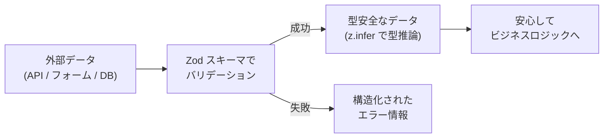

TypeScript を使っていると、「型があるから安全」と思いがちです。しかし TypeScript の型はあくまで **コンパイル時** のチェックであり、**ランタイム**（実行時）には一切存在しません。

例えば API レスポンスやフォーム入力など、**外部から入ってくるデータ** が本当に期待した型と一致しているかは、TypeScript だけでは保証できません。

そこで登場するのが **Zod** です。

---

# Zod とは？

**Zod** [^1]は、TypeScript ファーストの **スキーマ宣言 & バリデーションライブラリ** です。

**主な特徴**

| 特徴                   | 説明                                                            |
| ---------------------- | --------------------------------------------------------------- |
| TypeScript ファースト  | スキーマから TypeScript の型を自動推論できる                    |
| ゼロ依存               | 外部ライブラリへの依存がない（軽量）                            |
| イミュータブル         | メソッドチェーンのたびに新しいインスタンスを返す                |
| 豊富なバリデーション   | 文字列・数値・配列・オブジェクト・ユニオンなど幅広く対応        |
| エコシステムとの親和性 | React Hook Form, tRPC, Next.js など主要ライブラリとの連携が容易 |

---

# 環境構築

では、ハンズオンをやってみましょう。

**前提条件**

- Node.js（v18 以上推奨）
- TypeScript 5.x 以上

## プロジェクトのセットアップ

```bash
# プロジェクトディレクトリを作成
mkdir zod-handson && cd zod-handson

# 初期化
npm init -y

# Zod と TypeScript のインストール
npm install zod
npm install -D typescript ts-node @types/node

# tsconfig.json の生成
npx tsc --init
```

`tsconfig.json` で以下の設定が有効になっていることを確認してください。

```json
{
  "compilerOptions": {
    "strict": true,
    "target": "ES2020",
    "module": "commonjs",
    "esModuleInterop": true,
    "outDir": "./dist"
  }
}
```

---

# ハンズオン ① — 基本的なスキーマ定義

まずは最もシンプルなプリミティブ型のバリデーションから始めましょう。

- `src/01-primitives.ts`

```typescript
import { z } from "zod";

// --- 文字列スキーマ ---
const nameSchema = z.string();

console.log(nameSchema.parse("Taro")); // ✅ "Taro"
// console.log(nameSchema.parse(123));        // ❌ ZodError がスローされる

// --- 数値スキーマ ---
const ageSchema = z.number().int().min(0).max(150);

console.log(ageSchema.parse(25)); // ✅ 25
// console.log(ageSchema.parse(-1));          // ❌ ZodError

// --- 真偽値スキーマ ---
const isActiveSchema = z.boolean();

console.log(isActiveSchema.parse(true)); // ✅ true

// --- safeParse: エラーをスローせずに結果を取得 ---
const result = ageSchema.safeParse("not a number");
if (!result.success) {
  console.log("バリデーションエラー:", result.error.issues);
} else {
  console.log("値:", result.data);
}
```

- 実行

```bash
npx ts-node src/01-primitives.ts
```

- 実行結果

```bash
Taro
25
true
バリデーションエラー: [
  {
    expected: 'number',
    code: 'invalid_type',
    path: [],
    message: 'Invalid input: expected number, received string'
  }
]
```

- ポイント

| メソッド           | 挙動                                                 |
| ------------------ | ---------------------------------------------------- |
| `.parse(data)`     | バリデーション失敗時に `ZodError` をスローする       |
| `.safeParse(data)` | スローせず `{ success, data, error }` を返す（推奨） |

---

# ハンズオン ② — オブジェクトスキーマと型推論

Zod の真価はオブジェクトスキーマにあります。スキーマから TypeScript の型を **自動生成** できます。

- `src/02-object.ts`

```typescript
import { z } from "zod";

// ユーザースキーマの定義
const UserSchema = z.object({
  id: z.number().int().positive(),
  name: z.string().min(1, "名前は必須です"),
  email: z.string().email("有効なメールアドレスを入力してください"),
  age: z.number().int().min(0).optional(), // 任意項目
  role: z.enum(["admin", "editor", "viewer"]), // 列挙型
  createdAt: z.string().datetime(), // ISO 8601 形式
});

// スキーマから TypeScript の型を自動推論 🎉
type User = z.infer<typeof UserSchema>;
// ↓ 推論結果:
// type User = {
//   id: number;
//   name: string;
//   email: string;
//   age?: number | undefined;
//   role: "admin" | "editor" | "viewer";
//   createdAt: string;
// }

// --- 正常系 ---
const validUser: unknown = {
  id: 1,
  name: "田中太郎",
  email: "taro@example.com",
  role: "admin",
  createdAt: "2026-03-23T10:00:00Z",
};

const parsed = UserSchema.parse(validUser);
console.log("✅ パース成功:", parsed);

// --- 異常系 ---
const invalidUser: unknown = {
  id: -1,
  name: "",
  email: "not-an-email",
  role: "superadmin",
  createdAt: "yesterday",
};

const result = UserSchema.safeParse(invalidUser);
if (!result.success) {
  console.log("❌ バリデーションエラー一覧:");
  result.error.issues.forEach((issue) => {
    console.log(`  [${issue.path.join(".")}] ${issue.message}`);
  });
}
```

- 実行

```bash
npx ts-node src/02-object.ts
```

- 出力例

```bash
✅ パース成功: {
  id: 1,
  name: '田中太郎',
  email: 'taro@example.com',
  role: 'admin',
  createdAt: '2026-03-23T10:00:00Z'
}
❌ バリデーションエラー一覧:
  [id] Too small: expected number to be >0
  [name] 名前は必須です
  [email] 有効なメールアドレスを入力してください
  [role] Invalid option: expected one of "admin"|"editor"|"viewer"
  [createdAt] Invalid ISO datetime
```

---

# ハンズオン ③ — ネストとスキーマの合成

実際のアプリケーションでは、スキーマをネストしたり合成したりするケースが頻出します。

- `src/03-composition.ts`

```typescript
import { z } from "zod";

// 住所スキーマ
const AddressSchema = z.object({
  postalCode: z.string().regex(/^\d{3}-\d{4}$/, "例: 100-0001"),
  prefecture: z.string(),
  city: z.string(),
  street: z.string().optional(),
});

// ベースとなる人物スキーマ
const PersonSchema = z.object({
  name: z.string().min(1),
  age: z.number().int().nonnegative(),
});

// 拡張: PersonSchema に address と tags を追加
const CustomerSchema = PersonSchema.extend({
  address: AddressSchema,
  tags: z.array(z.string()).default([]),
});

type Customer = z.infer<typeof CustomerSchema>;

const data: unknown = {
  name: "佐藤花子",
  age: 30,
  address: {
    postalCode: "100-0001",
    prefecture: "東京都",
    city: "千代田区",
  },
};

const customer = CustomerSchema.parse(data);
console.log("✅ Customer:", customer);
// tags は default([]) により空配列が自動付与される
console.log("   tags:", customer.tags); // []
```

- スキーマ操作の早見表

```typescript
// pick — 特定のフィールドだけ抽出
const NameOnly = CustomerSchema.pick({ name: true });

// omit — 特定のフィールドを除外
const WithoutAddress = CustomerSchema.omit({ address: true });

// partial — すべてのフィールドを optional に
const PartialCustomer = CustomerSchema.partial();

// merge — 2 つのスキーマを統合
const MergedSchema = PersonSchema.merge(AddressSchema);
```

- 実行例

```bash
✅ Customer: {
  name: '佐藤花子',
  age: 30,
  address: { postalCode: '100-0001', prefecture: '東京都', city: '千代田区' },
  tags: []
}
   tags: []
```

---

# ハンズオン ④ — カスタムバリデーションと transform

- `src/04-advanced.ts`

```typescript
import { z } from "zod";

// --- refine: カスタムバリデーション ---
const PasswordSchema = z
  .string()
  .min(8, "8文字以上で入力してください")
  .refine((val) => /[A-Z]/.test(val), {
    message: "大文字を1文字以上含めてください",
  })
  .refine((val) => /[0-9]/.test(val), {
    message: "数字を1文字以上含めてください",
  });

console.log(PasswordSchema.safeParse("weakpass"));
// → { success: false, error: ... }

console.log(PasswordSchema.safeParse("Strong1Pass"));
// → { success: true, data: "Strong1Pass" }

// --- transform: パース時にデータを変換 ---
const TrimmedLowerEmail = z
  .string()
  .email()
  .transform((val) => val.trim().toLowerCase());

console.log(TrimmedLowerEmail.parse("  TARO@Example.COM  "));
// → "taro@example.com"

// --- superRefine: 複数フィールドにまたがるバリデーション ---
const SignupSchema = z
  .object({
    password: z.string().min(8),
    confirmPassword: z.string().min(8),
  })
  .superRefine((data, ctx) => {
    if (data.password !== data.confirmPassword) {
      ctx.addIssue({
        code: z.ZodIssueCode.custom,
        message: "パスワードが一致しません",
        path: ["confirmPassword"],
      });
    }
  });

const signupResult = SignupSchema.safeParse({
  password: "MySecret123",
  confirmPassword: "Different456",
});

if (!signupResult.success) {
  console.log("❌", signupResult.error.issues[0].message);
  // → "パスワードが一致しません"
}
```

---

# ハンズオン ⑤ — API レスポンスのバリデーション（実践例）

最後に、実際のユースケースに近い「外部 API レスポンスのバリデーション」を実装してみましょう。

- `src/05-api-validation.ts`

```typescript
import { z } from "zod";

// API レスポンスのスキーマ定義
const ApiPostSchema = z.object({
  userId: z.number(),
  id: z.number(),
  title: z.string(),
  body: z.string(),
});

// 配列レスポンス用
const ApiPostListSchema = z.array(ApiPostSchema);

// 型を自動生成
type ApiPost = z.infer<typeof ApiPostSchema>;

// バリデーション付き fetch 関数
async function fetchPosts(): Promise<ApiPost[]> {
  const response = await fetch(
    "https://jsonplaceholder.typicode.com/posts?_limit=3"
  );
  const rawData: unknown = await response.json();

  // ここでランタイムバリデーション！
  const result = ApiPostListSchema.safeParse(rawData);

  if (!result.success) {
    console.error("API レスポンスが期待した形式と異なります:");
    console.error(result.error.issues);
    throw new Error("Invalid API response");
  }

  return result.data; // 型安全な ApiPost[] が返る
}

// 実行
(async () => {
  try {
    const posts = await fetchPosts();
    posts.forEach((post) => {
      console.log(`📝 [${post.id}] ${post.title}`);
    });
  } catch (err) {
    console.error("取得に失敗しました:", err);
  }
})();
```

- 実行

```bash
npx ts-node src/05-api-validation.ts
```

- 実行結果

```bash
📝 [1] sunt aut facere repellat provident occaecati excepturi optio reprehenderit
📝 [2] qui est esse
📝 [3] ea molestias quasi exercitationem repellat qui ipsa sit aut
```

---

# よく使うスキーマメソッド チートシート

| カテゴリ            | メソッド                                                                    | 説明                     |
| ------------------- | --------------------------------------------------------------------------- | ------------------------ |
| プリミティブ        | `z.string()`, `z.number()`, `z.boolean()`, `z.date()`                       | 基本型                   |
| 文字列制約          | `.min()`, `.max()`, `.email()`, `.url()`, `.regex()`, `.uuid()`             | 文字列バリデーション     |
| 数値制約            | `.int()`, `.positive()`, `.nonnegative()`, `.min()`, `.max()`               | 数値バリデーション       |
| オブジェクト        | `z.object({})`, `.extend()`, `.merge()`, `.pick()`, `.omit()`, `.partial()` | オブジェクト操作         |
| 配列                | `z.array()`, `.nonempty()`, `.min()`, `.max()`                              | 配列バリデーション       |
| ユニオン / リテラル | `z.union()`, `z.discriminatedUnion()`, `z.literal()`, `z.enum()`            | 合成型                   |
| 変換 / カスタム     | `.transform()`, `.refine()`, `.superRefine()`, `.default()`, `.catch()`     | 拡張処理                 |
| 型推論              | `z.infer<typeof schema>`                                                    | スキーマから TS 型を取得 |

---

# まとめ



| 従来の課題                       | Zod による解決                           |
| -------------------------------- | ---------------------------------------- |
| 型定義とバリデーションが二重管理 | スキーマから型を自動推論（`z.infer`）    |
| ランタイムでの型安全性がない     | `parse` / `safeParse` で実行時にチェック |
| バリデーションロジックが散在     | スキーマに集約し、再利用可能に           |
| エラーメッセージが不親切         | `issues` 配列で構造化されたエラーを提供  |

Zod は **「TypeScript の型安全性をランタイムまで拡張する」** ための必須ツールです。特に API 通信やフォームバリデーションといった **信頼境界（Trust Boundary）** を超えるデータの取り扱いにおいて、非常に大きな威力を発揮します。

ぜひ実際に手を動かして、Zod の便利さを体感してみてください！

---

[^1]: [Zod（ドキュメント）](https://zod.dev/)
